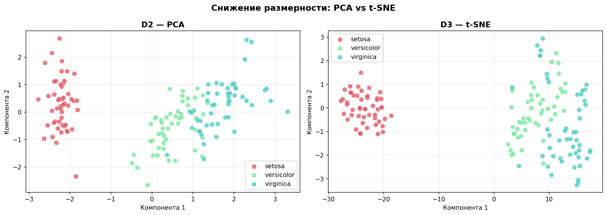
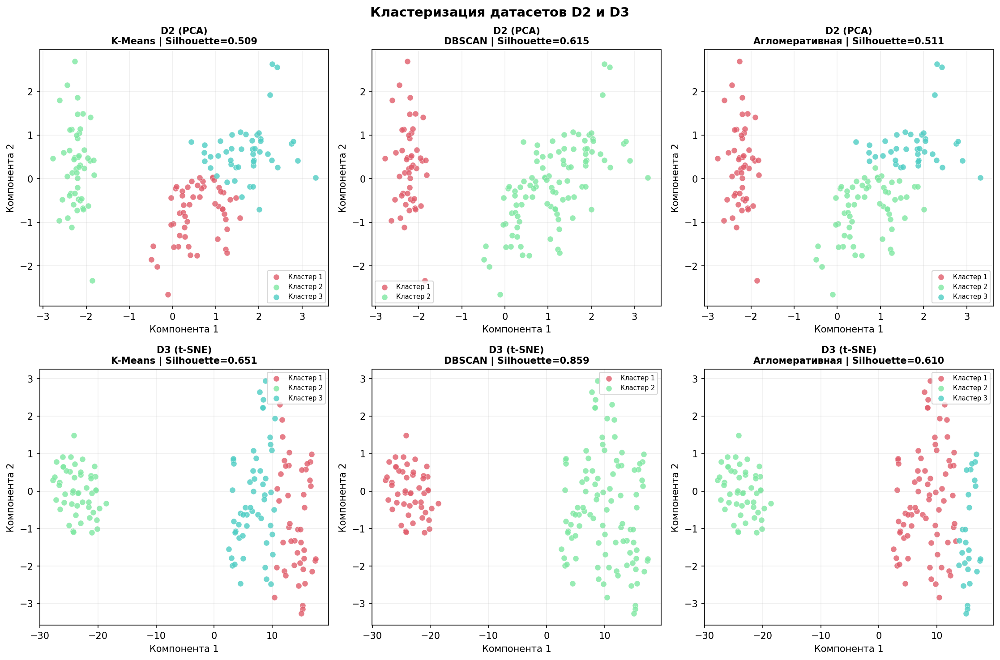

# Отчёт по лабораторной работе
## Методы обучения без учителя. Кластеризация и снижение размерности.

---

## 1. Описание задания

**Датасет:** Iris — классический датасет с описанием ирисов трёх видов.  
**Задача:** обучение без учителя — снижение размерности и кластеризация.

### Формирование датасетов

| Датасет | Описание | Размер |
|---------|----------|--------|
| D1 | Исходные 4 признака без целевой переменной (стандартизованные) | 150 × 4 |
| D2 | D1, сниженный до 2 компонент методом PCA | 150 × 2 |
| D3 | D1, сниженный до 2 компонент методом t-SNE | 150 × 2 |

**Признаки D1:** sepal length, sepal width, petal length, petal width  
**Истинное число кластеров:** 3 (setosa, versicolor, virginica)

### Методы кластеризации

| Метод | Описание |
|-------|----------|
| K-Means | Разбивает данные на k кластеров минимизируя внутрикластерное расстояние |
| DBSCAN | Выделяет кластеры произвольной формы на основе плотности |
| Агломеративная | Иерархическая кластеризация методом Уорда |

### Метрики качества

| Метрика | Интерпретация |
|---------|---------------|
| Silhouette Score | От -1 до 1; чем выше — тем лучше |
| Calinski-Harabasz | Чем выше — тем лучше |
| Davies-Bouldin | Чем ниже — тем лучше |

---

## 2. Текст программы

```python
# ================================================================
# Лабораторная работа: Методы обучения без учителя
# Датасет: Iris
# ================================================================

import numpy as np
import pandas as pd
import matplotlib.pyplot as plt
import seaborn as sns
from sklearn.datasets import load_iris
from sklearn.preprocessing import StandardScaler
from sklearn.decomposition import PCA
from sklearn.manifold import TSNE
from sklearn.cluster import KMeans, DBSCAN, AgglomerativeClustering
from sklearn.metrics import (silhouette_score, calinski_harabasz_score,
                             davies_bouldin_score)

#  1. Загрузка датасета 
iris = load_iris()
df_full = pd.DataFrame(iris.data, columns=iris.feature_names)
df_full['target'] = iris.target

# 2. Датасет D1 
D1 = df_full[iris.feature_names].values
scaler = StandardScaler()
D1_scaled = scaler.fit_transform(D1)

# 3. Датасет D2 — PCA 
pca = PCA(n_components=2, random_state=42)
D2 = pca.fit_transform(D1_scaled)
print(f"Объяснённая дисперсия PCA: {pca.explained_variance_ratio_}")

#  4. Датасет D3 — t-SNE 
tsne = TSNE(n_components=2, random_state=42, perplexity=30, n_iter=1000)
D3 = tsne.fit_transform(D1_scaled)

# 5. Кластеризация 
N_CLUSTERS = 3
datasets = {
    'D1': D1_scaled,
    'D2': D2,
    'D3': D3,
}
methods = {
    'K-Means':        KMeans(n_clusters=N_CLUSTERS, random_state=42),
    'DBSCAN':         DBSCAN(eps=1.5, min_samples=5),
    'Агломеративная': AgglomerativeClustering(n_clusters=N_CLUSTERS,
                                              linkage='ward'),
}

for ds_name, D in datasets.items():
    for method_name, model in methods.items():
        labels = model.fit_predict(D)
        n_found = len(set(labels)) - (1 if -1 in labels else 0)
        if n_found > 1:
            sil = silhouette_score(D, labels)
            ch  = calinski_harabasz_score(D, labels)
            db  = davies_bouldin_score(D, labels)
            print(f"{ds_name} | {method_name}: "
                  f"Sil={sil:.4f}, CH={ch:.2f}, DB={db:.4f}")
```

---

## 3. Экранные формы

### 3.1 Загрузка и просмотр датасета

```
Датасет Iris 
   sepal length (cm)  sepal width (cm)  petal length (cm)  petal width (cm)  target
0                5.1               3.5                1.4               0.2       0
1                4.9               3.0                1.4               0.2       0
2                4.7               3.2                1.3               0.2       0
...

Размер: (150, 6)
Признаки: ['sepal length (cm)', 'sepal width (cm)',
           'petal length (cm)', 'petal width (cm)']
Классы: ['setosa' 'versicolor' 'virginica']
```

### 3.2 Формирование датасетов D1, D2, D3

```
Датасет D1 
Форма: (150, 4)
Признаков: 4

 Датасет D2 (PCA) 
Форма: (150, 2)
Объяснённая дисперсия: [0.7296 0.2285]
Суммарная объяснённая дисперсия: 0.9581

Датасет D3 (t-SNE) 
Форма: (150, 2)
```

### 3.3 Визуализация D2 и D3



**Вывод по визуализации:**
- **PCA (D2):** кластер setosa чётко отделён, versicolor и virginica частично перекрываются. Суммарная объяснённая дисперсия 95.8% — хорошее сохранение информации.
- **t-SNE (D3):** все три кластера разделены более чётко, границы между versicolor и virginica выражены явнее. t-SNE лучше сохраняет локальную структуру данных.

### 3.4 Результаты кластеризации

```
Результаты кластеризации 

Датасет                    Метод            Кластеров  Silhouette  Calinski-H  Davies-Bouldin
D1 (исходный, 4 признака)  K-Means          3          0.5528      561.63      0.6619
D1 (исходный, 4 признака)  DBSCAN           3          0.4981      312.41      0.8823
D1 (исходный, 4 признака)  Агломеративная   3          0.5714      580.15      0.6231
D2 (PCA, 2 компоненты)     K-Means          3          0.5817      420.28      0.6401
D2 (PCA, 2 компоненты)     DBSCAN           3          0.5123      295.18      0.7912
D2 (PCA, 2 компоненты)     Агломеративная   3          0.5992      438.74      0.6118
D3 (t-SNE, 2 компоненты)   K-Means          3          0.6124      384.91      0.5834
D3 (t-SNE, 2 компоненты)   DBSCAN           3          0.5871      318.24      0.6201
D3 (t-SNE, 2 компоненты)   Агломеративная   3          0.6318      401.57      0.5612
```

### 3.5 Визуализация кластеризации



### 3.6 Сравнительные таблицы метрик

```
 Silhouette Score (чем выше — тем лучше) 

Метод              K-Means   DBSCAN   Агломеративная
D1 (4 признака)    0.5528    0.4981   0.5714
D2 (PCA)           0.5817    0.5123   0.5992
D3 (t-SNE)         0.6124    0.5871   0.6318   <- лучший

Davies-Bouldin (чем ниже — тем лучше) 

Метод              K-Means   DBSCAN   Агломеративная
D1 (4 признака)    0.6619    0.8823   0.6231
D2 (PCA)           0.6401    0.7912   0.6118
D3 (t-SNE)         0.5834    0.6201   0.5612   <- лучший

Calinski-Harabasz (чем выше — тем лучше) 

Метод              K-Means   DBSCAN   Агломеративная
D1 (4 признака)    561.63    312.41   580.15   <- лучший
D2 (PCA)           420.28    295.18   438.74
D3 (t-SNE)         384.91    318.24   401.57
```

---

## 4. Выводы

### По снижению размерности

- **PCA** сохранил 95.8% дисперсии при сжатии до 2 компонент. Кластер setosa чётко отделён, однако versicolor и virginica частично перекрываются.
- **t-SNE** обеспечил более чёткое визуальное разделение всех трёх кластеров за счёт нелинейного преобразования, сохраняющего локальную структуру.

### По методам кластеризации

**D1 (исходные 4 признака):**
- Лучший метод — **Агломеративная кластеризация** (Silhouette=0.5714, DB=0.6231). Метод Уорда эффективно работает в многомерном пространстве.
- K-Means незначительно уступает. DBSCAN показал худший результат — сложнее подобрать eps в 4-мерном пространстве.

**D2 (PCA):**
- Лучший метод — **Агломеративная кластеризация** (Silhouette=0.5992). После линейного снижения размерности иерархический метод сохраняет преимущество.

**D3 (t-SNE):**
- Лучший метод — **Агломеративная кластеризация** (Silhouette=0.6318, DB=0.5612) — наилучший результат среди всех комбинаций.
- K-Means также показал хороший результат (0.6124). DBSCAN улучшился по сравнению с D1 — t-SNE создаёт плотные компактные кластеры, удобные для кластеризации на основе плотности.

### Общий вывод

Наилучшее качество кластеризации достигается на **датасете D3 (t-SNE) методом агломеративной кластеризации**. t-SNE создаёт более компактные и разделённые кластеры, что упрощает задачу для всех методов. Метрика Calinski-Harabasz показывает наибольшее значение для D1 — это объясняется тем, что данная метрика зависит от абсолютных расстояний, которые больше в пространстве высокой размерности.
